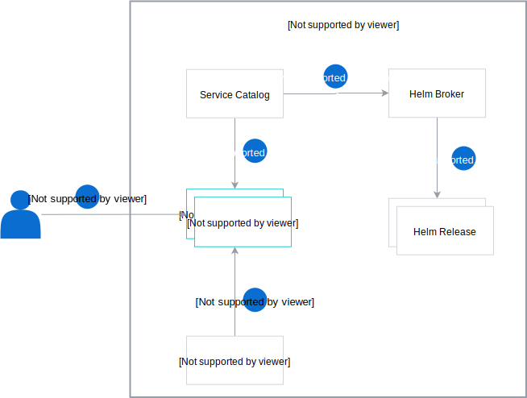

# How to install Addons in a secure way 

Created on 2020-06-15 by Mateusz Szostok ([@mszostok](https://github.com/mszostok)).

This document describes how the Helm Broker can install Helm Charts using same privileges as the user who created a ServiceInstance.

## Motivation

Helm was using Tiller to maintain the state of a Helm release. To do so, Tiller required a "God mode" which means that it needs to have admin role-based access controls (RBAC). For the security reason, [Tiller was removed in Helm 3](https://helm.sh/docs/faq/#removal-of-tiller) and now releases are maintain based on the user RBAC.

## Goal

User/ServiceAccount RBAC is used for provisioning a given [Addon](https://github.com/kyma-project/addons) via Service Catalog. If tenant lacks resource permission then the provisioning is failed and proper error is reported.
  
## Suggested solution

The Service Catalog has the [OriginatingIdentity](https://github.com/kubernetes-sigs/service-catalog/blob/b6afbc9fec94e7b0d350f22e736d0484d181b351/pkg/features/features.go#L31-L37) feature which set the [UserInfo](https://github.com/kubernetes-sigs/service-catalog/blob/5068f67d9616bab9e21dae8a161578a034a0803a/pkg/apis/servicecatalog/v1beta1/types.go#L748-L754) field. This field is available both for the ServiceInstances and ServiceBindings. It contains information about the user that last changed a resource's `spec` entry.

```yaml
- apiVersion: servicecatalog.k8s.io/v1beta1
  kind: ServiceInstance
  metadata:
    name: redis
    namespace: impersonate-helm-broker
  spec:
    # ...
    userInfo:
      extra:
        user-assertion.cloud.google.com:
        - AK8TC8KFMXbRT79OYNitihN7n/Hu5WPJCl/R4Csa+q5Pps2PURkphBC+nfYhQ6//1Tk2GCz4rfLTSlLuav8gDTdwq/mWjpjUVrtTA4vhcuxJyPfo27VUkCFhYZ94X7UBgp35TdtPI+SPX8POwWM0JnJzR29wQ7aKdNitWnuS6GAkNxxHeKc6MWzuqppfs526DyfV6w+bEbwbnqDoAO0VuRfhEOUL1eOqpgCW01SF5qf8
      groups:
      - system:authenticated
      uid: ""
      username: mateusz.szostok@sap.com
```

On the other hand, the Kubernetes client has a [user impersonation](https://kubernetes.io/docs/reference/access-authn-authz/authentication/#user-impersonation) feature which we can leverage during the helm chart installation.

### Architecture 

The new workflow consists of the following steps:

1. The user or K8s controller (technical user) creates the ServiceInstance for a given Addon.
2. Service Catalog reacts on newly created ServiceInstances 
3. and sends the provisioning request to the Helm Broker. The `UserInfo` is included in the provisioning HTTP header. 
4. Helm Broker extracts the `UserInfo` from the header and creates a Helm client with `ImpersonateUser` set to the `username` from the request. 

<p align="center">
 
</p>

> **NOTE:** In the first phase, the support for binding is out of scope, but the Service Catalog enables that flow too.

> **NOTE:** The above solution works both for the User and ServiceAccount. K8s client should be configured in a such way: 
> - for User, the **{USERNAME}** should used
> - for SA the **system:serviceaccount:{NAMESPACE}:{SERVICEACCOUNT}** should used
>
> Naming is already handled by the Service Catalog webhook and `userInfo.username` contains a proper value.

## Proof of Concept

The PoC was created in [impersonate-helm-broker](https://github.com/mszostok/impersonate-helm-broker) repository.

Follow these steps to validate the proposed workflow: 

1. Create a Kyma cluster.
2. Update Service Catalog Webhook Deployment. Run:
    ```bash
   kubectl set image deployment/service-catalog-catalog-webhook svr=mszostok/service-catalog-amd64:fixed-userinfo
    ```
3. Checkout [Impersonate Helm Broker](https://github.com/mszostok/impersonate-helm-broker) repository locally.
4. Install the Impersonate Helm Broker. Run:
    ```bash
    kubectl create -f ./deploy
    ```
5. Create a ServiceInstance as the admin who has all privileges. Run: 
    ```bash
   kubectl create -f ./example/si_admin.yaml --as=admin@kyma.cx
    ```
6. Check the status of the created ServiceInstance. Run:
    ```bash
    kubectl get serviceinstance redis-admin
    ```   
   The ServiceInstance should be in a **Ready** state. Example output:
   ```bash
   NAME             CLASS                       PLAN      STATUS   AGE
   redis-admin      ClusterServiceClass/redis   default   Ready    10s
   ```

7. Create a ServiceInstance as **user2** which doesn't have permission for creating K8s resources other that ServiceInstance. Run: 
    ```bash
   kubectl create -f ./example/si_user2.yaml --as=user2@kyma.cx
    ```
8. Check the status of the created ServiceInstance. Run:
    ```bash
    kubectl get serviceinstance redis-user2
    ```   
   The ServiceInstance should be in a **OrphanMitigationSuccessful** state. Example output:
   ```bash
   NAME          CLASS                       PLAN      STATUS                       AGE
   redis-user2   ClusterServiceClass/redis   default   OrphanMitigationSuccessful   13m
   ```

   You can check the Service Catalog controller logs to find the provisioning error. Run:
   ```bash
    kubectl logs $(kubectl get po -n kyma-system -l app=service-catalog-catalog-controller-manager --no-headers -ocustom-columns=name:.metadata.name) -n kyma-system -c controller-manager | grep "Error syncing ServiceInstance impersonate-helm-broker/redis-user2"
    ```
   Expected output: 
   ```bash
    I0615 19:07:13.243344       1 controller.go:404] Error syncing ServiceInstance impersonate-helm-broker/redis-user2 (retry: 0/15): Error provisioning ServiceInstance of ClusterServiceClass (K8S: "123-123-123-123-123-123" ExternalName: "redis") at ClusterServiceBroker "impersonate-helm-broker": Status: 500; ErrorMessage: <nil>; Description: namespaces is forbidden: User "user2@kyma.cx" cannot create resource "namespaces" in API group "" at the cluster scope; ResponseError: <nil>
   ```

### Consequences for an accepted proposal

The PoC shows that the [OriginatingIdentity](https://github.com/kubernetes-sigs/service-catalog/blob/b6afbc9fec94e7b0d350f22e736d0484d181b351/pkg/features/features.go#L31-L37) feature is not working as expected. When ServiceInstance is created by the user then the given ServiceInstance is processed by the Service Catalog controller. The controller adds fields under the `spec` entry causing that it is the last one that modified the ServiceInstance and the UserInfo is always populated with the Service Catalog controller service account. This breaks the flow because the Helm Broker does not know the actual author. Before implementing the proposed solution in Helm Broker the pull request which fixes that issue needs to be merged and a new Service Catalog needs to be used in Kyma.
